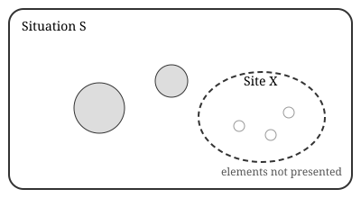

# Introduction {#sec-intro}

Contemporary continental philosophy has repeatedly returned to a question that
analytic metaphysics tends to treat as settled: what is the status of what is
*not* actual? Two influential answers stand out. The first, developed by
Giorgio Agamben across a series of essays, takes its bearings from Aristotle's
account of *dynamis* and insists that genuine potentiality includes the
potentiality not to [@agambenPotentialities99, 177--84]. The second, set out
in Alain Badiou's *Being and Event*, locates novelty not in a latent capacity
but in an event that is strictly supernumerary with respect to the situation in
which it occurs [@badiouBeing07, 178].

These positions are usually read as opposed. @agambenPotentialities99 treats
the passage to act as something that potentiality survives, while Badiou's
ontology has no place for potency at all. I will argue, however, that both
thinkers reject what I will call the *modal picture*: the view that the
possible is a well-defined space of alternatives from which the actual is
selected.[^modal] @sec-agamben reconstructs Agamben's account;
@sec-badiou turns to Badiou; and @sec-politics considers the political stakes.

[^modal]: The modal picture is most clearly articulated in the possible-worlds
    tradition. For a critical survey from within continental philosophy, see
    @allenWhy10, 45--52.

# Agamben: the potentiality not to {#sec-agamben}

Agamben's starting point is the Aristotelian claim that every potentiality is
also an impotentiality with respect to the same thing. The architect who does
not build retains the capacity to build; the capacity is not exhausted in its
exercise. What interests Agamben is the stronger thesis that this capacity to
not-be is itself constitutive of potentiality as such
[@agambenPotentialities99, 182; see also @agambenBartleby99].

> What is truly potential is thus what has exhausted itself in its own
> impotentiality. What is potential can both be and not be.
> [@agambenPotentialities99, 182]

The figure that condenses this thesis is Melville's scrivener, whose formula
"I would prefer not to" suspends the alternative between willing and not
willing [@agambenBartleby99, 255]. Bartleby does not refuse; he withdraws from
the space in which refusal and acceptance are options. It is in this sense that
Agamben can describe him as the "extreme figure of the Nothing from which all
creation derives" [@agambenBartleby99, 253].

Three features of this account matter for what follows:

1. Potentiality is not a property of a subject but a *mode of existence*.
2. The passage to act does not cancel potentiality but preserves it.
3. The paradigm cases are privative: the scribe who does not write, the
   musician who does not play.

## A note on sources {#sec-sources}

Agamben's reading draws heavily on commentaries that are not always cited in
the essays themselves. The Rigvedic material he occasionally invokes is quoted
from a standard translation [@jamisonRigveda14], and the political argument
develops themes from his earlier work on community [@agambencoming93].

# Badiou: the event as supplement {#sec-badiou}

Badiou's ontology begins from the axiomatic claim that the one is not. What
presents itself is always a multiplicity, and ontology is the discourse of pure
multiplicity, which Badiou identifies with Zermelo--Fraenkel set theory
[@badiouBeing07, 23--30]. A *situation* is a presented multiple; its *state*
is the count of its parts, which by Cantor's theorem always exceeds it:

$$
|\mathcal{P}(S)| > |S| \quad \text{for every set } S
$$ {#eq-cantor}

The event, by contrast, is a multiple that belongs to itself. Writing $e_x$ for
the event at the site $X$, Badiou's matheme is:

$$
e_x = \{ x \in X, e_x \}
$$ {#eq-matheme}

Because the axiom of foundation forbids self-membership, @eq-matheme names
something that ontology cannot present. The event is thus undecidable from
within the situation; it exists only through an intervention that names it and
a fidelity that tracks its consequences [@badiouBeing07, 201--11]. Badiou's
later work extends this account to the four "conditions" of philosophy --- art,
science, love and politics [@badiouConditions08; @badioucentury07].

@tbl-contrast summarises the contrast drawn so far.

| | Agamben | Badiou |
|---|---|---|
| Basic category | Potentiality (*dynamis*) | Event |
| Relation to the actual | Survives passage to act | Supplements the situation |
| Paradigm | Bartleby | The Paris Commune |
| Ontological register | Modal, privative | Set-theoretic, axiomatic |

: Agamben and Badiou compared {#tbl-contrast}

{#fig-site width=60%}

@fig-site represents the evental site schematically. The crucial point is that
the site is "on the edge of the void" [@badiouBeing07, 175]: it is presented,
but nothing it contains is.

# Politics after the possible {#sec-politics}

If both thinkers reject the modal picture, their political conclusions
nevertheless diverge sharply. For Agamben, the task is to render inoperative
the apparatuses that capture potentiality, and politics culminates in a form of
life that cannot be separated from its potential [@agambencoming93, 43].
For Badiou, politics is a procedure of truth: a militant fidelity to an event
whose consequences must be worked out in a situation that resists them
[@badiouEthics01, 40--44; @badiouMetapolitics05].

This divergence can be traced to a single point. Agamben understands the
excess of the non-actual as something that belongs to beings --- a reserve that
is never used up. Badiou understands it as something that happens *to* a
situation from outside its count. The first yields an ethics of withdrawal, the
second an ethics of commitment. As @bartlettAlain10 have shown, Badiou's
critics frequently miss this distinction, treating fidelity as a form of
decisionism.[^decision]

[^decision]: Badiou's own response to the charge of decisionism is developed
    in the later essays [@badiouEthics01, 71--80]. Compare Allen's critique of
    normative foundations in @allenPower10.

```{=typst}
#v(1em)
#align(center)[#text(size: 0.9em, style: "italic")[--- End of main text ---]]
```

# Conclusion {#sec-conclusion}

The comparison suggests that the most important disagreement in contemporary
theories of the non-actual is not between those who affirm and those who deny
potentiality, but between two ways of refusing the possible. Whether that
refusal takes the form of Bartleby's formula or of the matheme in @eq-matheme,
it commits its proponent to a politics in which the new cannot be planned in
advance [@badiouEthics01; @agambenPotentialities99].
