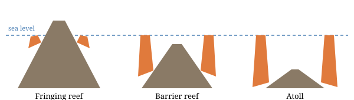

# Introduction {#sec-intro}

Some of the most consequential processes in nature are too slow to watch. A
reef rises a few millimetres a year; a field's surface is reworked one worm
casting at a time. Charles Darwin learned to think about such processes from
Charles Lyell, who argued that the earth's past could be explained by
*causes now in operation* [@lyellPrinciples30].

This paper follows that lesson through two of Darwin's studies. @darwinStructure42
explains the shape of coral islands by the slow sinking of the sea floor, and
@darwinFormation81 explains the burial of stones and ruins by the work of
earthworms.[^bookends] @sec-reefs takes the reefs; @sec-worms the worms; and
@sec-measure considers how Darwin measured what he could not see.

[^bookends]: The two books open and close his publishing career. On the
    voyage see @browneCharles95; on the last years, @browneCharles02.

# Coral reefs: the sinking floor {#sec-reefs}

On the Beagle, Darwin carried the first volume of Lyell's *Principles* and read
the landscapes he visited through it [@darwinJournal39]. Atolls posed a puzzle:
rings of reef in the open ocean, rising from great depths, although
reef-building corals live only near the surface.

Darwin's answer was subsidence. A reef begins as a fringe around a volcanic
island; as the island slowly sinks, the corals keep growing upward, leaving a
barrier reef and finally a ring with no island at all
[@darwinStructure42; see also @lyellPrinciples30].

> Earth-worms, though in appearance a small and despicable link in the chain
> of nature, yet, if lost, would make a lamentable chasm. [@whiteNatural89]

Gilbert White had made a similar point about worms decades earlier, and
Darwin would return to it. The structure of both arguments is the same: a
small, ordinary agent, multiplied over a long enough time, reshapes the land.

@fig-reefs shows the three stages of the subsidence theory.

{#fig-reefs width=80%}

# Earthworms: the moving surface {#sec-worms}

Darwin's interest in worms began in 1837, when he heard that cinders and lime
spread on a field years earlier now lay several inches below the turf. The
explanation, he argued, was that worms swallow earth below ground and leave it
as castings on the surface, so that anything resting on the surface is slowly
buried [@darwinFormation81, chap. 3].

If castings accumulate at a rate $r$ each year, an object left on the surface
lies at a depth

$$
d = r \, t
$$ {#eq-burial}

after $t$ years. @eq-burial is simple, but it turns an everyday observation
into a measurement: dig, find the buried layer, and divide.

@tbl-contrast summarises the comparison drawn so far.

| | Coral reefs | Earthworms |
|---|---|---|
| Agent | Reef-building corals | Earthworms |
| Visible effect | Atolls and barrier reefs | Buried stones and ruins |
| Timescale | Geological | Decades to centuries |
| Evidence | Reef form and soundings | Buried layers and castings |

: Two slow processes compared {#tbl-contrast}

# Measuring the invisible {#sec-measure}

Neither process could be seen happening, so Darwin built instruments of
patience. At Down House a heavy "worm stone", fitted with a gauge designed by
his son Horace, recorded how far it sank into the lawn over the years
[@browneCharles02]. For the reefs, confirmation had to wait: drilling on the
atoll of Enewetak in 1952 passed through more than a kilometre of reef
limestone before reaching volcanic rock.[^drill]

[^drill]: Darwin had proposed exactly this test, a deep boring through an
    atoll, in his lifetime. For the later history of earthworm research see
    @stewartEarth04.

```{=typst}
#v(1em)
#align(center)[#text(size: 0.9em, style: "italic")[--- End of main text ---]]
```

# Conclusion {#sec-conclusion}

Read together, the reef and worm studies show a single habit of mind: to look
for large effects in small, continuing causes, and to design observations long
enough to catch them. That habit, learned from Lyell and practised for half a
century, is also the method of the *Origin* [@darwinOrigin59, 490].
